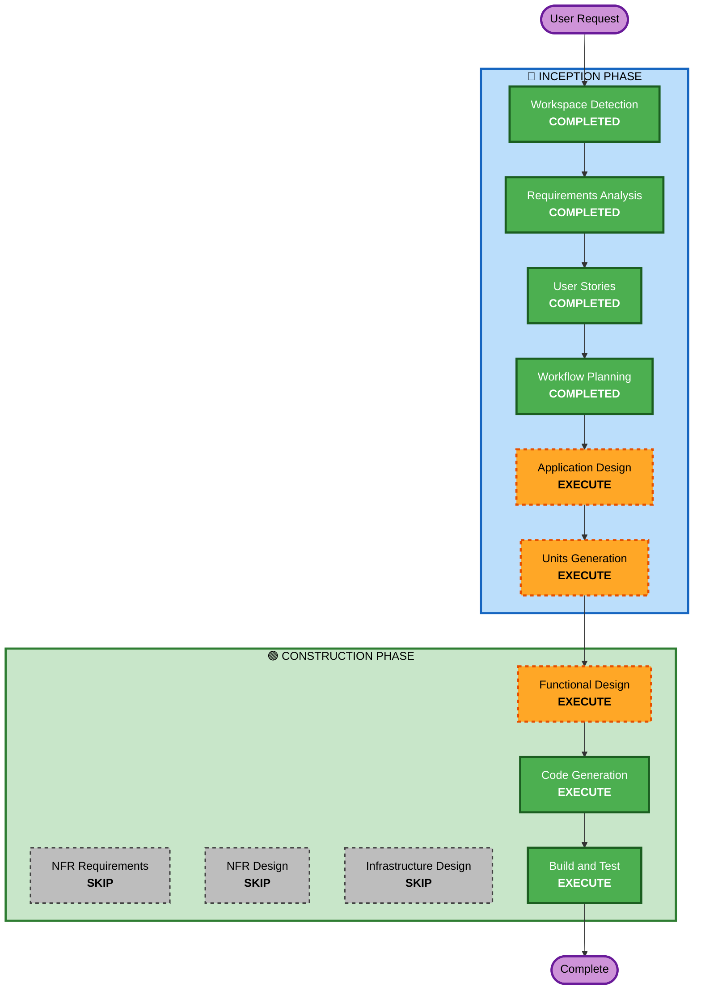

# Execution Plan

## Detailed Analysis Summary

### Change Impact Assessment
- **User-facing changes**: Yes — 고객용 주문 UI + 관리자 대시보드 신규 개발
- **Structural changes**: Yes — 전체 시스템 아키텍처 신규 설계 (FastAPI + Next.js + DynamoDB)
- **Data model changes**: Yes — DynamoDB 테이블 설계 필요 (Store, Table, Order, Menu 등)
- **API changes**: Yes — REST API 전체 신규 설계
- **NFR impact**: Yes — SSE 실시간 통신, 세션 관리, 동시 접속 처리

### Risk Assessment
- **Risk Level**: Medium (신규 프로젝트이나 기술 스택 조합의 복잡도 존재)
- **Rollback Complexity**: Easy (Greenfield - 롤백 불필요)
- **Testing Complexity**: Moderate (SSE 실시간 통신, 세션 관리 테스트 필요)

---

## Workflow Visualization



### Text Alternative
```
Phase 1: INCEPTION
- Workspace Detection (COMPLETED)
- Requirements Analysis (COMPLETED)
- User Stories (COMPLETED)
- Workflow Planning (COMPLETED)
- Application Design (EXECUTE)
- Units Generation (EXECUTE)

Phase 2: CONSTRUCTION
- Functional Design (EXECUTE, per-unit)
- NFR Requirements (SKIP)
- NFR Design (SKIP)
- Infrastructure Design (SKIP)
- Code Generation (EXECUTE, per-unit)
- Build and Test (EXECUTE)
```

---

## Phases to Execute

### 🔵 INCEPTION PHASE
- [x] Workspace Detection (COMPLETED)
- [x] Requirements Analysis (COMPLETED)
- [x] User Stories (COMPLETED)
- [x] Workflow Planning (COMPLETED)
- [ ] Application Design - **EXECUTE**
  - **Rationale**: 신규 프로젝트로 컴포넌트 식별, 서비스 레이어 설계, API 엔드포인트 정의 필요
- [ ] Units Generation - **EXECUTE**
  - **Rationale**: 백엔드(FastAPI) + 프론트엔드(Next.js) 다중 유닛으로 분해 필요

### 🟢 CONSTRUCTION PHASE (Per-Unit)
- [ ] Functional Design - **EXECUTE**
  - **Rationale**: DynamoDB 데이터 모델, 비즈니스 로직(세션 관리, 주문 상태 전이) 상세 설계 필요
- [ ] NFR Requirements - **SKIP**
  - **Rationale**: 소규모 MVP, 보안 확장 미적용, 로컬 배포로 별도 NFR 분석 불필요
- [ ] NFR Design - **SKIP**
  - **Rationale**: NFR Requirements 미실행으로 건너뜀
- [ ] Infrastructure Design - **SKIP**
  - **Rationale**: 로컬/온프레미스 배포로 클라우드 인프라 설계 불필요
- [ ] Code Generation - **EXECUTE** (ALWAYS)
  - **Rationale**: 실제 코드 구현 필요
- [ ] Build and Test - **EXECUTE** (ALWAYS)
  - **Rationale**: 빌드 및 테스트 지침 생성 필요

### 🟡 OPERATIONS PHASE
- [ ] Operations - **PLACEHOLDER**
  - **Rationale**: 향후 배포/모니터링 워크플로우 확장용

---

## Success Criteria
- **Primary Goal**: 테이블오더 MVP 서비스 완성 (고객 주문 + 관리자 모니터링)
- **Key Deliverables**:
  - FastAPI 백엔드 서버 (REST API + SSE)
  - Next.js 프론트엔드 (고객용 + 관리자용)
  - DynamoDB 데이터 모델
  - 빌드 및 테스트 지침
- **Quality Gates**:
  - 모든 API 엔드포인트 동작 확인
  - SSE 실시간 주문 알림 동작
  - 세션 관리 (자동 로그인, 4시간 만료) 동작
  - 장바구니 로컬 저장 동작
